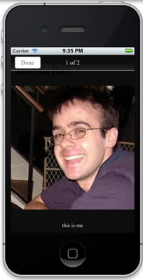

#jQuery mobileBox Plugin

mobileBox is ajQuery plugine used to display a mobile 
friendly slideshow rather than a lightbox.  I love lightbox's 
(especially colorbox), however they always seem to suck on my 
ipod touch.  The image is always really small, the close button
is about 1px and impossible to click and sometimes the image 
is completely off the screen. This plugin will generate a mobile
friendly (ipod, iphone, android) image view.  It works with a 
single image or gallery with a similar api to 
[colorbox](http://www.jacklmoore.com/colorbox)

## Install
Include the CSS file, image directory, and js file in the &lt;HEAD&gt;
```html
<link rel="stylesheet" href="mobileBox/style/mobileBox-min.css">
<script type="text/javascript" src="mobileBox/jquery.mobile-box-min.js"></script>
```
Then bind to the image link in the same way most other lightbox's work:
```html
<a class="someClassName" title="Image Title To Be In The Description" href="path/to/image.jpeg">text or image</a>
```

```javascript
$('.someClassName').mobileBox();
```
.mobileBox has several optional paramters:
* counter {String}. The counter in the title bar. Defaults to `{i} of {t}`
  `{i}` gets replaced with the index and `{t}` is the total number of images
  in the group or 1 if no group
* isTouch {Boolean} for development purposes I needed a way to force touch
  device. The mobileBox does not run when run in Chrome, but if you set
  this parameter to true and the browser size is smaller that 480, it works.
* disableWithMaxWidth {Integer} also mainly used for testing, but if you
  want mobileBox to fire with devices that have a screensize greater than
  the defauly 480, specify a size here in px.

##Example


## License 

(The MIT License)

Permission is hereby granted, free of charge, to any person obtaining
a copy of this software and associated documentation files (the
'Software'), to deal in the Software without restriction, including
without limitation the rights to use, copy, modify, merge, publish,
distribute, sublicense, and/or sell copies of the Software, and to
permit persons to whom the Software is furnished to do so, subject to
the following conditions:

The above copyright notice and this permission notice shall be
included in all copies or substantial portions of the Software.

THE SOFTWARE IS PROVIDED 'AS IS', WITHOUT WARRANTY OF ANY KIND,
EXPRESS OR IMPLIED, INCLUDING BUT NOT LIMITED TO THE WARRANTIES OF
MERCHANTABILITY, FITNESS FOR A PARTICULAR PURPOSE AND NONINFRINGEMENT.
IN NO EVENT SHALL THE AUTHORS OR COPYRIGHT HOLDERS BE LIABLE FOR ANY
CLAIM, DAMAGES OR OTHER LIABILITY, WHETHER IN AN ACTION OF CONTRACT,
TORT OR OTHERWISE, ARISING FROM, OUT OF OR IN CONNECTION WITH THE
SOFTWARE OR THE USE OR OTHER DEALINGS IN THE SOFTWARE.